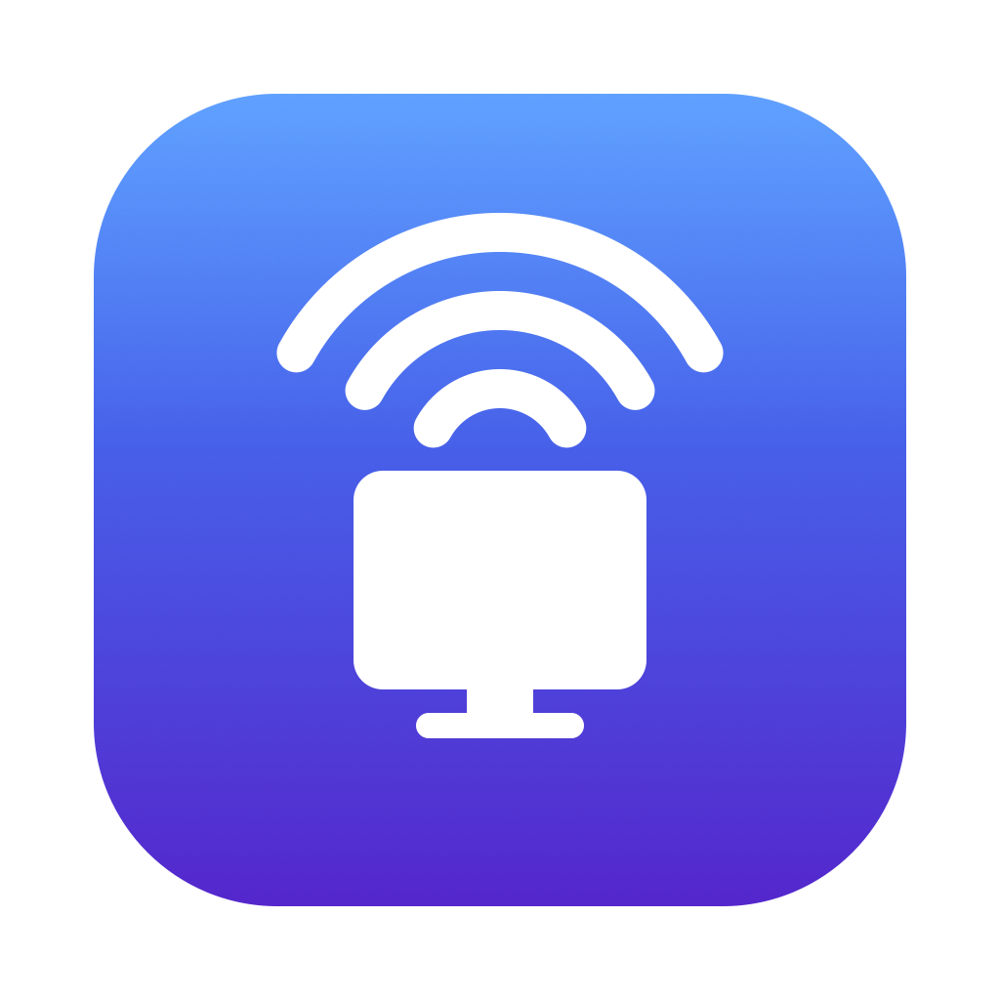

# Beam

[🇬🇧 English](README.md) · **🇫🇷 Français** · [🇪🇸 Español](README.es.md)

Partage d'écran et contrôle à distance natif pour macOS — de Mac à Mac, rapide.

[**⬇︎ Télécharger Beam.dmg**](https://github.com/Titi257/beam/releases/latest)

---

Voir et **contrôler** un autre Mac (souris + clavier), en réseau local ou via Internet, chiffré de bout en bout. Application **universelle** (Intel + Apple Silicon).

- **Réseau local : zéro configuration** — deux Macs sur le même Wi-Fi/réseau se trouvent et se connectent **directement** (latence minimale).
- **Via Internet** — connexion par **ID** depuis n'importe où, via un petit serveur relais.
- **Contrôle complet** clavier + souris, ou **mode lecture seule** (voir sans contrôler).
- **Appairage façon AnyDesk** : « Partager mon écran » donne un **ID à 9 chiffres** stable par machine ; l'autre Mac le saisit.
- **Chiffrement de bout en bout** (X25519 ECDH + AES-GCM) — ni le réseau local ni le relais ne voient autre chose que du chiffré. Un **code de sécurité** affiché des deux côtés se vérifie à l'oral pour écarter toute interception active.
- **Presse-papiers partagé** (texte + image) et **indicateur de qualité** en direct (FPS, débit, latence, direct vs relais).
- **Mises à jour automatiques** intégrées.

## Configuration requise

- **macOS 14 (Sonoma) ou plus récent.**
- **Mac Intel ou Apple Silicon** — universel, natif sur les deux.

## Installation

1. Téléchargez **`Beam.dmg`** depuis la [dernière version](https://github.com/Titi257/beam/releases/latest).
2. Ouvrez-le et glissez **Beam** dans **Applications**.
3. Lancez **Beam** depuis Applications.

> L'app est signée et notarisée par Apple — aucun avertissement « développeur non identifié ».

## Utilisation

Dans la fenêtre unique :

- **Partager mon écran** → vous obtenez un **ID**. Donnez-le à qui doit voir votre écran. À la connexion, une fenêtre **Accepter / Refuser** s'affiche ; accepter donne le contrôle clavier/souris (sauf en **lecture seule**).
- **Contrôler un autre Mac** → saisissez l'**ID** de l'autre Mac et cliquez **Se connecter**.

Laissez le champ serveur **vide** pour le mode réseau local (sans serveur), ou renseignez l'adresse de votre relais pour le mode Internet (les deux Macs doivent utiliser le **même** serveur).

Au premier usage, macOS demande **Enregistrement de l'écran**, **Accessibilité** et (en LAN) **Réseau local** — uniquement au côté qui en a besoin.

## Mises à jour

Beam vérifie les mises à jour automatiquement et propose **App ▸ Rechercher les mises à jour…**. Chaque mise à jour est signée cryptographiquement et vérifiée avant installation.

## Confidentialité & sécurité

Le média est **toujours chiffré de bout en bout**. Le relais (mode Internet) ne voit que du chiffré. Projet personnel, non audité — à utiliser en connaissance de cause.
